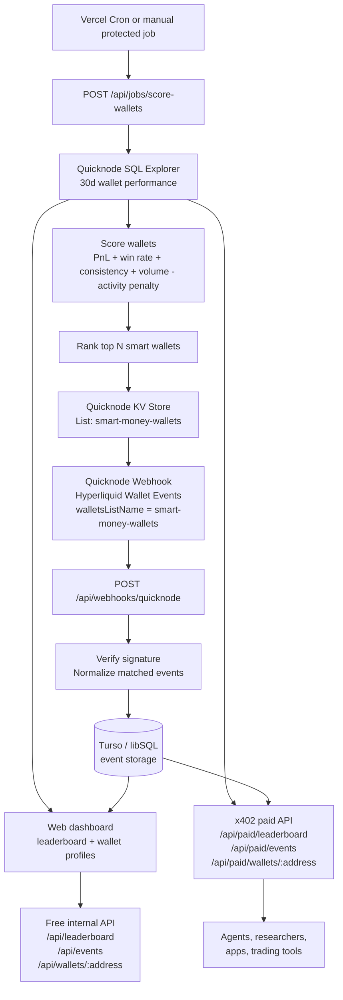

# Smart Money as a Service

Smart Money as a Service turns Hyperliquid wallet history into a live, usable smart-money feed. The app ranks wallets by recent trading quality using **Quicknode SQL Explorer**, keeps a dynamic watchlist in **Quicknode KV Store,** receives real-time wallet events through **Quicknode Webhooks**, and exposes both a dashboard and x402-paid JSON API for downstream consumers.

The problem is practical: profitable wallets are easy to talk about after the fact, but hard to operationalize. A useful system needs historical context, a scoring model that does more than sort by raw PnL, a live watchlist that changes as the leaderboard changes, and an API surface that can be used by agents, researchers, or trading tools without scraping a UI.

This project is built as a shippable MVP rather than a static demo. It runs with fixture data locally, upgrades to live Quicknode data when credentials are configured, persists webhook events with Turso, refreshes the watchlist through a protected cron job, and gates public API routes with x402.

## Core Features

- Builds a **daily smart-wallet leaderboard** from recent Hyperliquid trading history.
- Scores wallets using net PnL, win rate, consistency, volume, and an activity penalty for extremely noisy wallets.
- Updates a Quicknode KV Store list with the current top wallets so the Webhook watchlist changes **without redeploying code**.
- Receives Quicknode **Hyperliquid Wallet Events** for the active watchlist and stores normalized events.
- Shows a dashboard with leaderboard, selected-wallet profile, recent fills, current account context, and recent watched-wallet signals.
- Offers x402-paid public API routes for leaderboard, events, and wallet profiles.
- Falls back to fixtures so reviewers can run the app without provisioning every external service.

## Why Quicknode Matters Here

SQL Explorer is the historical brain of the product. It lets the app analyze wallet behavior across large Hyperliquid datasets without running an indexer.

KV Store plus Webhooks is the real-time loop. Instead of hardcoding addresses in a webhook filter, the scoring job writes the current leaderboard wallets into a KV Store list. The Webhook references that list by name, so as the leaderboard changes, the real-time monitored wallet set changes with it.

x402 turns the API into a monetizable surface. The dashboard stays free/internal, while `/api/paid/*` is ready for agentic or programmatic consumers that should pay per request.

## Scoring Model

The leaderboard is computed from the last 30 days of wallet-level trading activity. The daily job looks at each wallet's realized trading outcomes and aggregates:

- net profit after fees
- total trading volume
- number of fills
- number of active trading days
- number of profitable days
- win rate across active days

Wallets must clear minimum activity thresholds before they are considered. In the current app, this means meaningful 30-day volume and at least three active days, so one lucky trade does not dominate the leaderboard.

After SQL Explorer returns the candidate wallets, the app computes a score:

- **PnL component:** log-scaled positive net PnL, so profitable wallets rank higher without letting one outlier dwarf the list.
- **Win-rate component:** rewards win rate above a 45% baseline.
- **Consistency component:** rewards active days, capped at 30.
- **Volume component:** log-scaled volume, because size matters but should not be the whole score.
- **Activity penalty:** subtracts points for very high fill counts, which helps reduce noisy high-frequency or market-maker-like wallets.

The final rank sorts by score, then net PnL as a tiebreaker. The selected-wallet view then fetches recent fills and live Hyperliquid account context so the score is explainable rather than just a number.

The daily leaderboard check uses SQL Explorer in a few focused passes:

1. Pull candidate wallets from the last 30 days of daily wallet performance.
2. Aggregate each wallet's PnL, fees, volume, fill count, active days, and profitable days.
3. Filter out wallets without enough volume or activity.
4. Attach display names for ranked wallets when labels are available.
5. Fetch recent fills only when a wallet profile is opened, keeping the leaderboard query fast.

## Architecture



The important pattern is the feedback loop:

1. SQL Explorer finds wallets worth watching.
2. The scoring job writes those wallets to KV Store.
3. The Webhook reads that KV list dynamically.
4. New events flow back into the app without editing webhook config or redeploying.

## API Routes

Dashboard/internal routes stay free:

- `GET /api/leaderboard`
- `GET /api/events`
- `GET /api/wallets/[address]`

Paid public routes require x402 payment:

- `GET /api/paid/leaderboard`
- `GET /api/paid/events`
- `GET /api/paid/wallets/[address]`

Test an unpaid paid route:

```bash
curl -i http://localhost:3000/api/paid/leaderboard
```

Test the buyer flow with a funded Base Sepolia wallet:

```bash
PAID_API_BASE_URL=http://localhost:3000 EVM_PRIVATE_KEY=0x... pnpm test:paid-api
```

## Stack

- Next.js App Router
- React
- TypeScript
- Quicknode SQL Explorer
- Quicknode Hyperliquid SDK / Info API
- Quicknode Webhooks and KV Store
- Turso/libSQL
- x402
- Vitest

## Quick Start

```bash
pnpm install
cp .env.example .env
pnpm dev
```

Open `http://localhost:3000`.

With no credentials configured, the dashboard uses fixture data. Add environment variables to enable live data, durable events, webhook verification, cron updates, and paid API behavior.

## Environment

Never commit real secrets. Use `.env` locally and your host's secret manager in production.

| Variable | Required | Purpose |
| --- | --- | --- |
| `QUICKNODE_API_KEY` | Optional | Enables Quicknode SQL Explorer leaderboard reads and KV Store job writes. |
| `QUICKNODE_HYPERLIQUID_RPC_URL` | Optional | Enables live selected-wallet enrichment through the Hyperliquid SDK. |
| `QN_WEBHOOK_SECURITY_TOKEN` | Production webhook | Verifies Quicknode webhook deliveries. |
| `CRON_SECRET` | Production job | Protects `/api/jobs/score-wallets`. |
| `TURSO_DATABASE_URL` | Optional | Enables durable event storage. |
| `TURSO_AUTH_TOKEN` | Optional | Authenticates Turso/libSQL writes and reads. |
| `X402_PAY_TO_ADDRESS` | Paid API | Receiver wallet for `/api/paid/*`. |
| `X402_PRICE_USD` | Optional | Paid API price, default `$0.01`. |
| `X402_NETWORK` | Optional | x402 network, default `eip155:84532` for Base Sepolia. |
| `X402_FACILITATOR_URL` | Optional | x402 facilitator, default `https://x402.org/facilitator`. |

See [.env.example](./.env.example) for the full list.

## Webhooks

Configure a Quicknode Hyperliquid Wallet Events webhook to deliver to:

```text
POST https://YOUR_APP_URL/api/webhooks/quicknode
```

Set the same webhook security token in `QN_WEBHOOK_SECURITY_TOKEN`. Events are normalized and stored in Turso when configured; otherwise the UI falls back to fixture events.

## Jobs

The protected scoring job refreshes the Quicknode KV Store watchlist from the current ranked wallets:

```bash
curl -X POST "https://YOUR_APP_URL/api/jobs/score-wallets?dryRun=1" \
  -H "Authorization: Bearer YOUR_CRON_SECRET"
```

Vercel Cron is configured to run it daily at `00:00` UTC.

## AI-Assisted Build Workflow

AI was used as an implementation partner across the project: shaping the data model, iterating on the dashboard UI, writing route and webhook tests, integrating x402, tightening deployment docs, and doing repo hygiene/security checks. The workflow was code-first: inspect the existing repo, make scoped changes, run typecheck/tests/build, then commit working increments.

## Potential Improvements

- Add more Quicknode Webhook templates as Hyperliquid coverage expands, especially execution-level or order-level templates beyond wallet transfer/vault activity.
- Build opt-in copytrading workflows from webhook events, with strict risk caps, allowlists, max position sizing, and dry-run simulation before any live execution.
- Add wallet clustering and entity labels to separate funds, market makers, vault operators, and individual traders.
- Add backtesting for the scoring model: how top-ranked wallets performed after selection, not only before selection.
- Let users create their own watchlists and paid feeds rather than only consuming the global leaderboard.
- Replace dashboard polling with SSE or WebSockets for event delivery.
- Add alert routing to Discord, Telegram, Slack, or webhooks for teams that want signals outside the dashboard.
- Add API keys or account-level usage tracking on top of x402 for production billing and analytics.

## Development

```bash
pnpm typecheck
pnpm test
pnpm build
```


